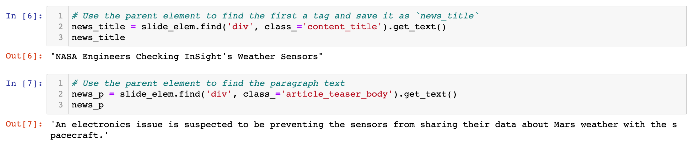
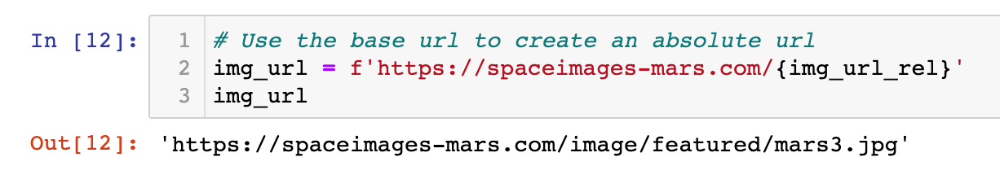
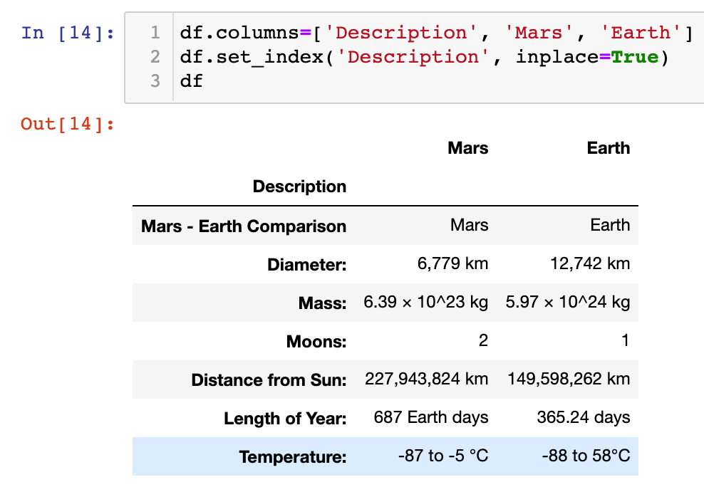
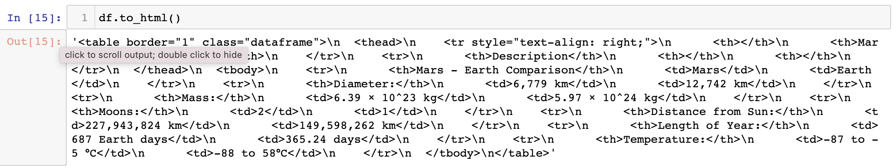
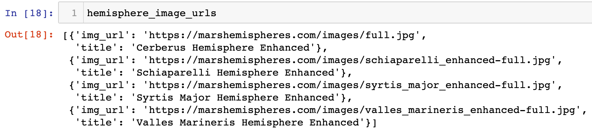
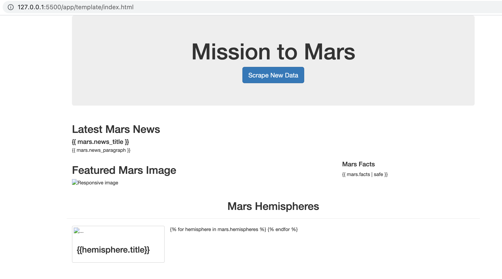
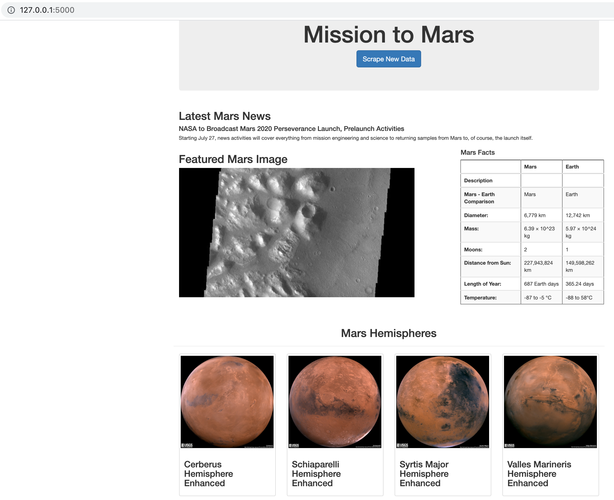

# Web-scraping-challenge - Mission to Mars

In this assignment, A web application was built that scrapes various websites for data related to the Mission to Mars and displays the information in a single HTML page. The following outlines what was done to achieve desired results.

## Step 1 - Scraping
- Initial scraping was completed using Jupyter Notebook, BeautifulSoup, Pandas, and Requests/Splinter.

- A Jupyter Notebook file called mission_to_mars.ipynb was created and used to complete all of our scraping and analysis tasks. The following outlines what was scraped.

### NASA Mars News

- The Mars News Site  was scraped and the latest News Title and Paragraph Text was collected. The text was assigned to variables and referenced later.

### JPL Mars Space Images - Featured Image

- The url for the Featured Space Image site was visited.

- Splinter was used to navigate the site and find the image url for the current Featured Mars Image and the url string was assigned to a variable called featured_image_url.

- The image url to the full size .jpg image was found.

- A complete url string for this image was saved.

### Mars Facts

- The Mars Facts webpage was visited and Pandas was used to scrape the table containing facts about the planet including Diameter, Mass, etc.

- Pandas was used to convert the data to a HTML table string.

### Mars Hemispheres

- The astrogeology site was visited to obtain high resolution images for each of Mar's hemispheres.

- The links to the hemispheres was clicked in order to find the image url to the full resolution image.

- Both the image url string for the full resolution hemisphere image, and the Hemisphere title containing the hemisphere name. A Python dictionary was used to store the data using the keys img_url and title.

- The dictionary with the image url string and the hemisphere title was appended to a list. This list will contain one dictionary for each hemisphere.

## Step 2 - MongoDB and Flask Application
- MongoDB with Flask templating was used to create a new HTML page that displays all of the information that was scraped from the URLs above.

- Our Jupyter notebook into a Python script called scrape_mars.py with a function called scrape that executed all of your scraping code from above and return one Python dictionary containing all of the scraped data.

- A route called /scrape that will import our scrape_mars.py script and call our scrape function.

- The return value was stored in Mongo as a Python dictionary.

- A root route '/' was created that will query our Mongo database and pass the mars data into an HTML template to display the data.

- A template HTML file called index.html was created that takes the mars data dictionary and display all of the data in the appropriate HTML elements.  

<b> index.html before rendering

  
  
 <b> index.html after rendering
   
 

